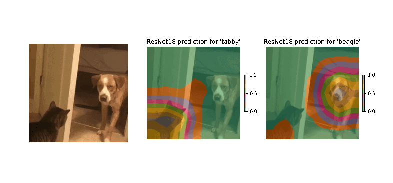
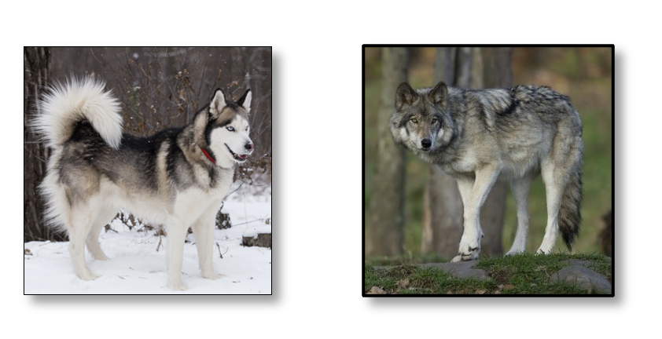
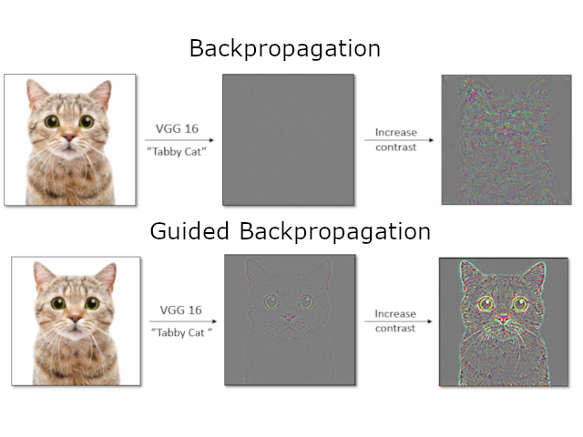
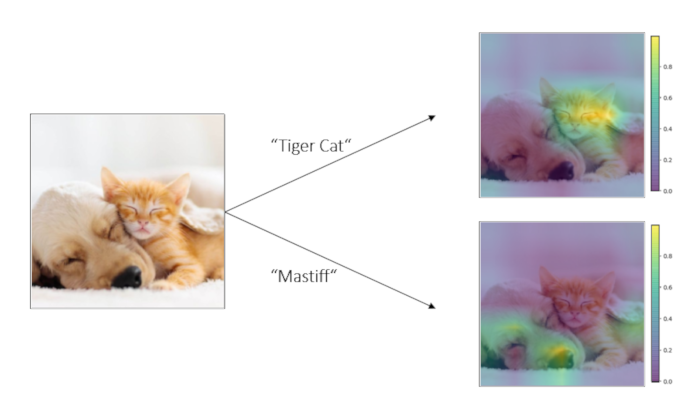
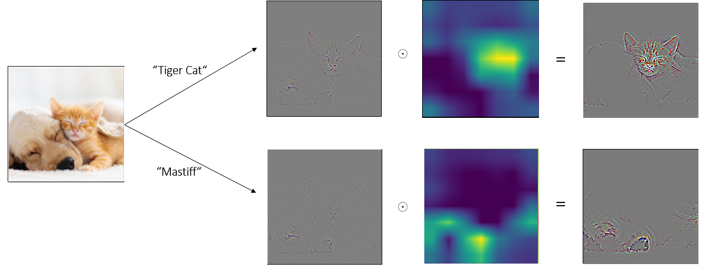

# pytorch-saliency
||
|:--:| 
|*Result of using `saliency(model=model, method="GradCAM")` with a ResNet18 model which was trained for **classification** on Imagenet. The model is queried for predictions for cats and dogs in the image and the respective returned attention maps are shown.*|

`pytorch-saliency` is a PyTorch based implementation of popular saliency mapping methods for 2D and 3D convsolution based models. These are methods which allow you to better understand how your classification model arrives at a prediction by highlighting regions in your input space which are driving those predictions. Furthermore, such methods allow you to extract coarse segmentation maps from a model which was trained for classification alone!

Currently included methods are 
* GradCAM [^6]
* Guided backpropagation [^2]
* Guided GradCAM

# Usage
The general usage pattern consists of generating a `saliency(model, method)` object and then querying instances for predictions. A minimal example looks like the following
````
import pytorch_saliency as ps
import torch

# load pre-trained VGG16
vgg16 = torch.hub.load('pytorch/vision:v0.10.0', 'resnet18', pretrained=True)
vgg16.eval()

# prep data
...
input_batch = torch.rand((1, 3, 224, 224)) # BCHW for 2D or BCDHW for 3D

# group convolutional part, fc part and adaptive layer in-between in vgg16; use print(model) to find model specific architectures in general
conv_section = ['conv1', 'bn1', 'relu', 'maxpool', 'layer1', 'layer2', 'layer3', 'layer4']
fc_section = ['fc']
adaptive_layer = 'avgpool'

# instantiate GradCAM and query for cat
GradCAM = ps.saliency(model=vgg16, 
                    method="GradCAM", 
                    mode="2D", 
                    section_names = [conv_section, fc_section], adaptive_layer=adaptive_layer
                    )
preds, maps = GradCAM(input_batch, target_class=[281]) # target class corresponds to index in model output

# plot original image with attention map overlayed
ps.saliency_plot(input_batch, maps, mode="2D", alpha=0.8)
````

For more detailed examples check out the following notebooks
* [2D example](./examples/2d_example.ipynb)
* 3D example

# How can this be useful?
* **Improve trust in your predictions:** By highlighting regions which are relevant for a prediction we can increase our trust in our model and its ability to generalize. 
* **Detect biases in your training data:** Imagine a CNN which classifies between wolves and Huskies. One can imagine a scenario where the network reaches high accuracy but what might be actually happening is that the network looks at the presence of snow for its prediction. Without knowing anything about the inner workings of the network such biases might be difficult to detect when the evaluation of the network is solely based on conventional metrics like prediction accuracy.
<p align="center">
  
</p>

* **Human Learning:** In a scenario where a model outperforms humans in a task one can think of gaining deeper understanding or domain knowledge via the learned representation of the model
* **Generate free segmentation maps:** Saliency methods can also be used to extract a coarse segmentation from a model which is solely trained on classification because the latter usually requires an internal representation of the former. 

# How does it work? 

In the following we discuss the Guided Backpropagation[^2] and Grad-CAM[^6] method for the generation of saliency maps. Here we use the term "saliency map" in a very broad sense for any kind of attention maps which highlight prediction relevant spatial features in the input data.

The question we want to answer is the following: given an output of a network, what aspects of the input data where decisive for the prediction for a specific class. In the case of image data we are interested in image regions which are most relevant for a specific prediction. Note that "relevancy" here is a statement about the learned representation of the network.

## Guided Backpropagation

As a first approach one could try to find the most relevant modes in the input data by differentiating the network output for a specific class $S_c$ with respect to the input image $x_0$

$$
 \frac{\partial S^c(x)}{\partial x_{i,j}}\Bigr\rvert_{x_0}
$$

It turns out, however, that this leads to rather noisy results[^1] (see Figure below) which result from interference between positive and negative gradients during backpropagation. This problem is addressed by the Guided Backpropagation[^2] method (`ps.saliency(method="GuidedBackprop")`). The basic idea is that negative gradients are suppressed during backpropagation leading to very detailed maps of pixel importance.

<p align="center">
  
</p>

Although both of these methods are based on backpropagation with respect to specific output layer neurons (corresponding to distinct classes) they are in fact *not* class discriminative. The reasons for this are not straight forward but related to the fact that instance-specific information is encoded in the network during the forward pass[^3] [^4].

## CAM and Grad-CAM
In order to find a method which is able to differentiate between classes one can meditate on the following two observations

* Deeper layers of CNNs are known to encode higher level semantics
* Spatial correlations are maintained throughout the convolutional part up until the fully connected classifier part.

It could be therefore argued that the output of the last convolutional layer holds most of the semantic and spatial information relevant for prediction. A method based on this idea is the Class activation mapping (CAM)[^5] method. The authors look at a CNN architecture without a fully connected part at the end but instead with a global average pooling layer. Each of the feature map in the final convolutional layer is thus reduced to a single value which in turn is directly coupled to the network output. Since every class has its unique set of weights for this last connection these weights can be interpreted as a importance weighting of the final feature maps. An upscaled, weighted average of the feature maps therefore gives as a class specific activation map.

Although this quite simple approach yields very impressive results its shortcomings are rather severe. One has to sacrifice performance (no fully connected part) for interpretability and is restricted to a very specific class of architectures. A generalization of CAM which can be applied to arbitrary networks with a convolutional block without any re-training is a gradient based method called Grad-CAM (Gradient-weighted class activation maps)[^6] (`ps.saliency(method="GradCAM")`). The idea is similar to before but here one uses the averaged gradients of the final feature maps $A^k_{x,y}$ to compute class $c$ specific weights

$$
w^c_k \propto \sum_{i,j}\frac{\partial S^c}{\partial A^k_{i,j}}
$$

The class activation map is then given by

$$
M^c(i,j) = \sum_k w^c_kA^k_{i,j}
$$

which in turn is put through a ReLU (we are only interested in positive contributions to the class) and then upscaled to input size.

<p align="center">
  
</p>

The method shows very nice class differentiating properties. Note how the network even detects the ear of the fluffy dog behind the cats head!

Finally, we can combine the Grad-CAM method and the Guided Backpropagation method to generate very detailed, class discriminative maps by combining the outputs of the two methods (`ps.saliency(method="GuidedGradCAM")`)

<p align="center">
  
</p>

## References
[^1]: Simonyan et al., *Deep Inside Convolutional Networks: Visualising Image Classification Models and Saliency Maps*, 2013. [Arxiv](https://arxiv.org/pdf/1312.6034.pdf)
[^2]: JT Springenberg et al., *Striving for Simplicity: The All Convolutional Net*, 2014. [Arxiv](https://arxiv.org/pdf/1412.6806.pdf)
[^3]: J Gu et al., *Understanding Individual Decisions of CNNs via Contrastive Backpropagation*, 2018. [Arxiv](https://arxiv.org/pdf/1812.02100.pdf)
[^4]: A Mahendran, A Vedaldi *Salient Deconvolutional Networks*, 2016.
[^5]: B Zhou et al., *Learning Deep Features for Discriminative Localization*, 2015. [Arxiv](https://arxiv.org/pdf/1512.04150.pdf)
[^6]: RR Selvaraju et al., *Grad-CAM: Visual Explanations from Deep Networks via Gradient-based Localization*, 2016. [Arxiv](https://arxiv.org/pdf/1610.02391.pdf)
